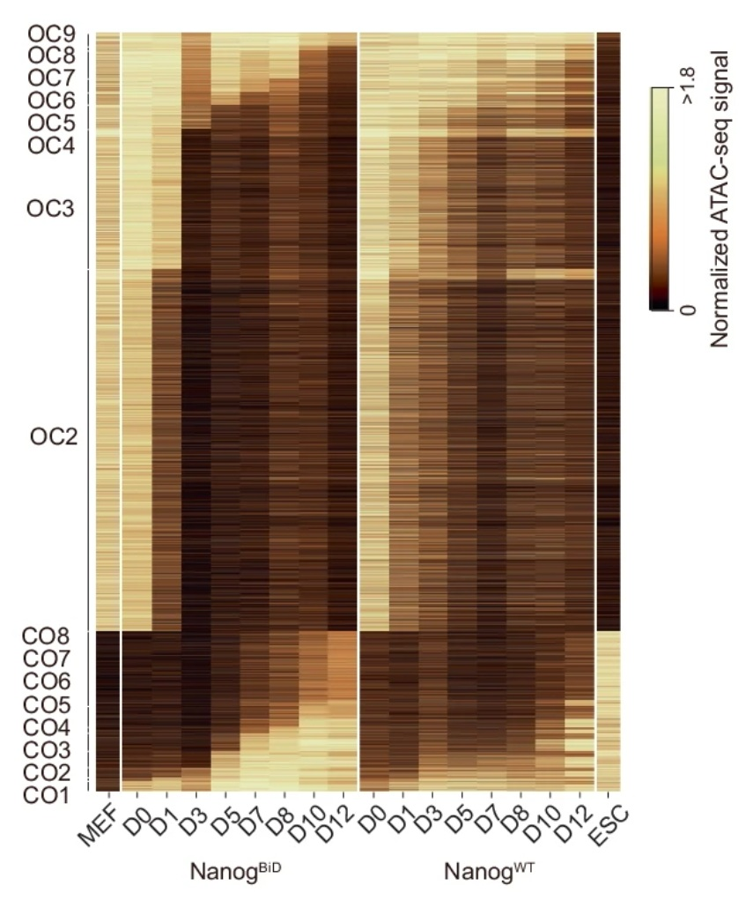
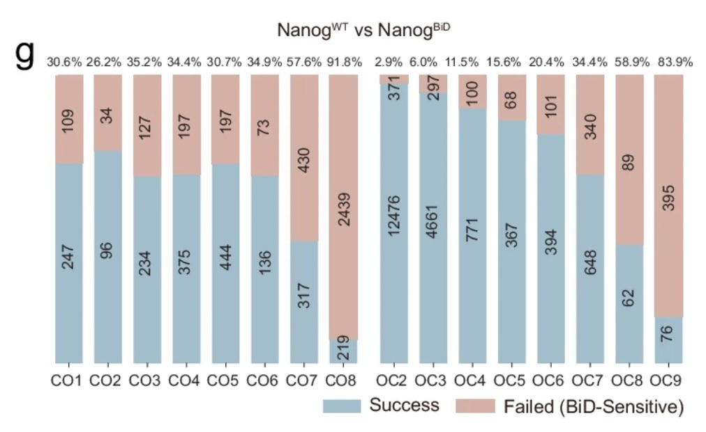
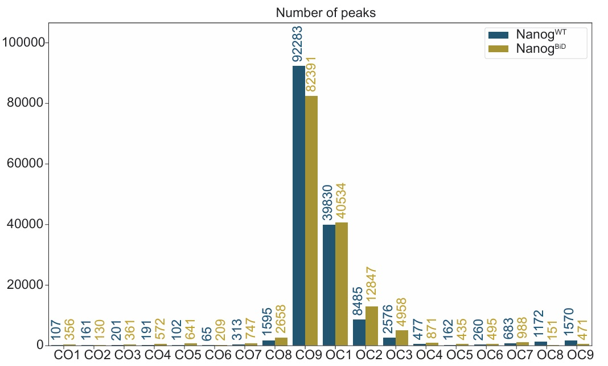
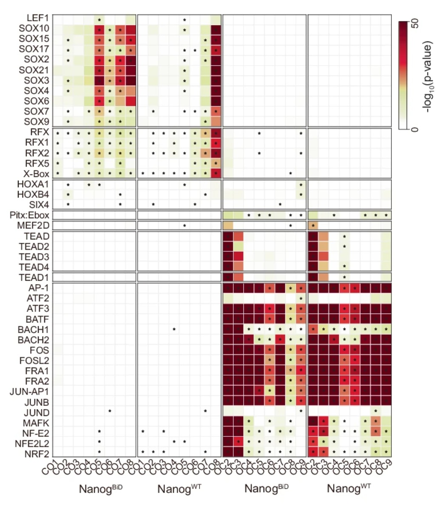

# ATAC OCCO

利用ATAC数据，分析随着时间变化的CO和OC区域

- 部分示例结果[文章链接](https://www.nature.com/articles/s41467-024-50551-2)

## 一、输入参数说明

### 1. 参数：`基因组`

文件对应的基因组版本，选择即可。

### 2. 参数：`Peak文件后缀`

Peak文件后缀，比如.e5_peaks

### 3. 参数：`Summit文件后缀`

Summit文件后缀，比如.e5_summits

### 4. 参数：`隐藏类别`

需要在结果内去除的类别，每行一个类别，比如OC1

### 5. 参数：`隐藏Motif`

需要在结果内去除的Motif，每行一个motif，如NF1:FOXA1(CTF,Forkhead)

### 6. 参数：`第一个是处理组`

是否metadata内第一个tag_group是处理组，否则的话第一个为对照组

### 7. 数据：`样本meta`，[模板文件](./docs/atac_occo/ATACTimesFail.meta.xlsx)

样本metadata，里面有三列，sample/tag_time/tag_group，tag_group限制两类，每一类的tag_time的数量及顺序需要相同

### 8. 数据：`Bw文件夹`

BigWig文件所在的文件夹

### 9. 数据：`Peak文件夹`

Peak文件所在的文件夹

## 二、输出文件说明

## 三、任务作者

winter <winter_lonely@foxmail.com>
