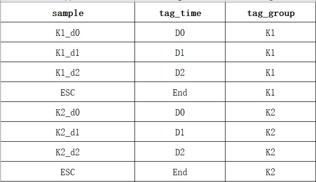
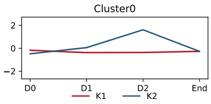

# Cluster K-Means

将表格数据按照列聚类K-Means聚类

### 一、输入参数说明

#### 1. 数据：`表格数据`

需要聚类的数据文件，除了第一列，其余列为样本。如果输入多个则根据第一列自动进行合并

#### 2. 数据：`meta文件`，[模板文件](./docs/cluster_kmeans/ClusterKMeans.meta.xlsx)

样本metadata，里面有三列，sample/tag_time/tag_group，tag_group为每一类处理，每一类的tag_time的数量及顺序需要相同

metadata数据示例

对应结果示例

#### 3. 参数：`类别数量`

需要聚为多少个类别

#### 4. 参数：`zscore`、`log2`

数据是否需要进行Z-Score或log2(data+1)

#### 5. 参数：`聚类阈值方法`

聚类阈值的三种方法：

1. cos: cos
2. eu: euclidean metric
3. cor: pearson correlation

#### 6. 参数：`palette`

画图的颜色

### 二、输出文件说明

## 三、任务作者

winter <winter_lonely@foxmail.com>
