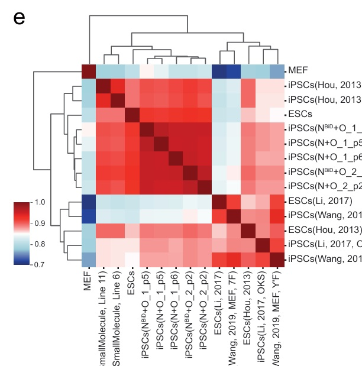

# Correlation Python

利用python计算样本的相关性，会根据样本标签和样本分别做相关性，即每个样本之间的相关性和每类样本之间的相关性

- 部分示例结果[文章链接](https://www.nature.com/articles/s41467-024-50551-2)

## 一、输入参数说明

### 1. 数据：`表达矩阵`

基因表达矩阵，每一行是一个基因，每一列是一个样本。多个文件自动根据基因合并。如果是transcript fpkm时，前几列为chr、strand、start、end、refseq、num_exons、length、gene_symbol。genesymbol_fpkm时第一列为gene_symbol

### 2. 数据：`meta文件`，[模板文件](./docs/correlation_python/Correlation.meta.xlsx)

excel文件，存在experiment、sample和tag三列，experiment为实验名称，根据不同实验名称去批次效应，sample为样本id，tag为样本标签，注意样本id需要与表达矩阵文件的列名对应

### 3. 数据：`相关性gene`

利用给定的基因计算相关性，每个txt文件为一个基因列表，文件每行一个基因，不提供则使用所有基因

## 二、输出文件说明

### 1. 相关性的数据

顶层的每个文件夹为使用的基因计算的相关性，`.log`为使用log2(fpkm+1)作为计算数据，否则使用原始fpkm计算。

### 2. 相关性的数据

`Cor`开头文件，`.tag`为根据标签分组均值做相关性，`.sample`为每个样本做相关性。`.annot`为显示相关性的数值，否则不显示。`.log`为使用log2(fpkm+1)作为计算数据，否则使用原始fpkm计算。

### 3. 降维的数据

`PCA`、`tSNE`或`UMAP`开头文件。如果样本数量多（大于30个），则使用`tSNE`和`UMAP`降维，否则使用`PCA`降维。`.rm`为去除批次效应
    
## 三、任务作者

winter <winter_lonely@foxmail.com>
