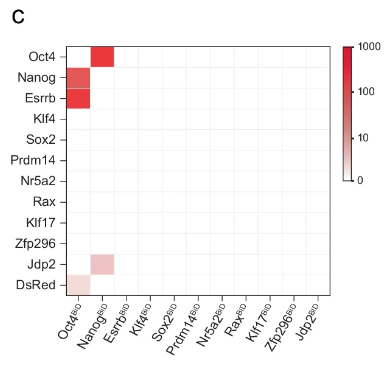

# Expression Heatmap

基因表达热图

- 部分示例结果[文章链接](https://www.nature.com/articles/s41467-024-50551-2)

## 一、输入参数说明

### 1. 参数：`色轴`

色轴颜色

### 2. 参数：`样本顺序`

需要画热图的样本顺序，不提供则使用所有样本并自动排序

### 3. 数据：`表达矩阵`

基因表达矩阵，每一行是一个基因，每一列是一个样本。多个文件自动根据基因合并

### 4. 数据：`画图gene`

需要画热图的基因，文件内每一行为一个基因

## 二、输出文件说明

三种类型的基因热图

- raw：使用原始数据画图

- log：将数据取`log2(exp+1)`后画图

- zscore：将数据按基因取`Z-Score`后画图
    
## 三、任务作者

winter <winter_lonely@foxmail.com>
